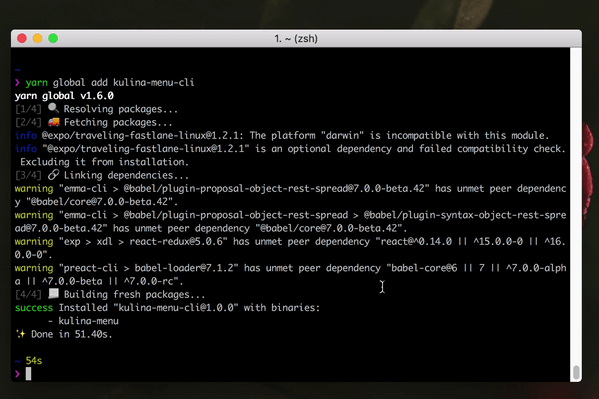

# Kulina Menu CLI



## Installation

```sh
$ npm i -g kulina-menu-cli
# or
$ yarn global add kulina-menu-cli
# or without installing
$ npx kulina-menu-cli
```

## Usage

```sh
$ kulina-menu
```

### Options

* `--count` (`-c`), <`Number`>: the count of fetched menu. Default: `5`

## License

MIT © [Muhammad Mustadi](https://github.com/mathdroid)
